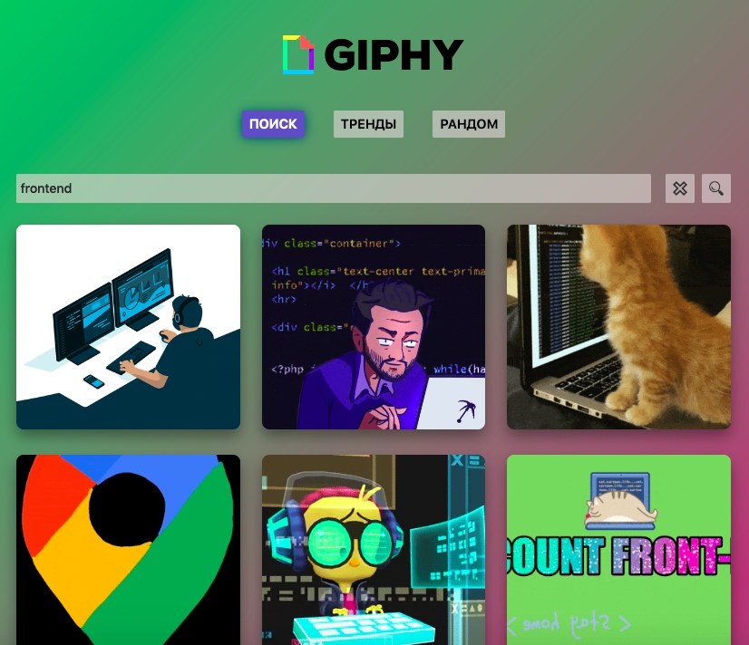

# GIPHY

**GitHub Pages**

[Ссылка на GitHub Pages](https://danieledefoe.github.io/gifs-application/)

_Технологический стэк:_

###  |  |  | 

### Установка зависимостей

`npm install`

### Запуск проекта на локальном сервере

`npm run dev`

### Сборка проекта

`npm run build`

### Деплой проекта

`npm run deploy`

### Просмотр собранного проекта

`npm run preview`

### _Описание проекта:_ SPA(Single Page Application) на React с поиском гифок, отображение популярных гифок, выдачей случайной гифки.

### _Технологии и функционал_

1.  флексбокс-вёрстка;
2.  позиционирование;
3.  продвинутую семантику языка HTML5;
4.  grid;
5.  методология **БЭМ**;
6.  псевдоклассы и псевдоэлементы;
7.  REACT;
8.  JSX разметка;
9.  Функциональные компоненты;
10. Хуки:
    - useState;
    - useEffect;
    - useCallback;
    - useSearchParams;
    - useRef.
11. REDUX:
    - Provider;
    - useSelector;
    - useDispatch;
12. REDUX/Toolkit:
    - configureStore;
    - createSlice;
    - createAsyncThunk.
13. настроена работа с API.
14. сборка Vite.
